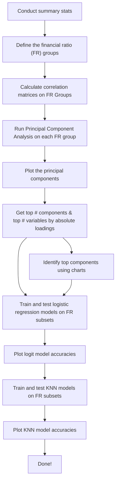

# Corporate-bankrupty-predictions
# Team-119
 Team 119's group project GitHub repository for MGT 6203 (Canvas) Spring of 2024 semester.

## Steps to Run:

- Ensure R and RStudio are installed.
- Clone the repo to your local machine.
- Install R packages specified in requirements.txt.
- Make sure you're on the "main" branch if there are other branches.
- Locate the .Rmd "bankruptcy-logit-knn.Rmd" in the Code folder.
- Run the .Rmd file (Run All).
- It should locate the root directory and find the appropriate folders, etc. using the "here" package.

## Code Process

